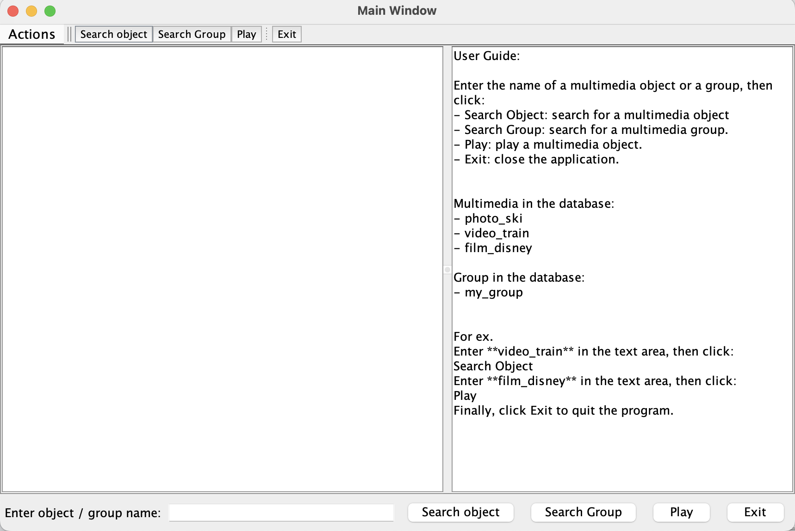

# Telecom Paris INF-224 Project

## Quick Start

To luanch the project, first go to the cpp directory and launch the server: 
```
cd cpp 
make run
```

Then create a new session, head to the swing directory and launch the Java Swing GUI: 
```
cd swing
make run
```

This would open a Java Swing GUI window: 



You can follow the user guide on the right to search or play multimedia object in the database. Have fun :)

## Answers to the questions: 

**Q.4:**
It is pure virtual function, to make a function purely virtual, we can use: 
```virtual void my_func(args) = 0.```
A class with pure virtual function can not be instantiated, this is because it has become to abstract class, and the pure virtual function is not defined. 

**Q.5**
The characteristic here is polymorphisme. To do this, we need to set functions to be virtual and use pointers. 

The element of the list is pointer. We need upcasting to make the polymorphisme valid. In java we don't need to do this because each object is represented by reference. 

**Q.7**
We need to implement deep copy function on our own for the class. If we use the shallow copy by default, the memory pointed by pointers would be deleted twice, since only the pointers have been copied, and thus we will have error. By the deep copy function we implement, both the pointers and the pointed objects will be copied, and thus deleting objects would not throw errors. 

**Q.8**
Because we need to use the upcasting mechanism of pointers to let polymorphisme works. At test time, functions of different derived classes will be called and generate answers. 

**Q.10**
To prevent creating the object with ```new```, we can set the constructor function to ```private```. 

The question 12 and 13 have not been addressed.

**Q.1 (of java swing)**
We find that after many clicks, the answers exceed the window. To prevent this, we can use the ```JScrollPane``` component that adds a vertical and horizontal scrollbar when necessary.